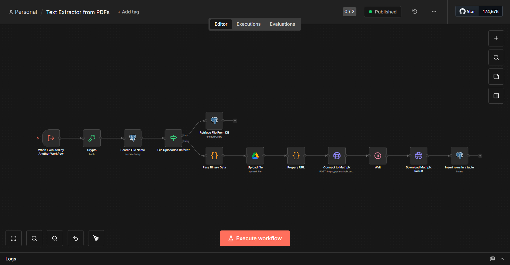
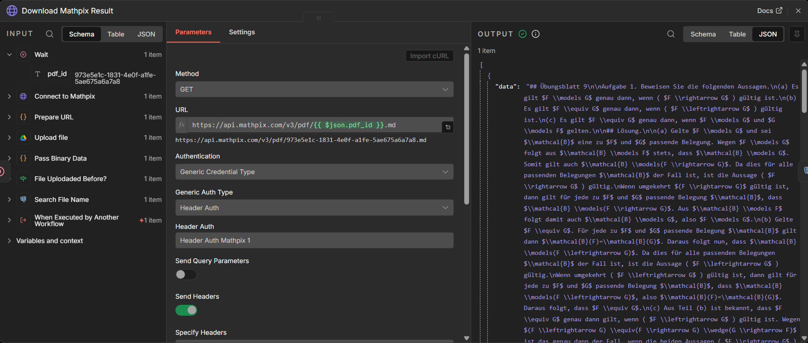

# PDF-Textextraktor-Workflow

*English version below / Deutsche Version zuerst*

Ein n8n-Workflow, der automatisch Text aus PDF-Dateien mit der Mathpix OCR-API extrahiert, mit intelligentem Caching, um eine erneute Verarbeitung derselben Dateien zu vermeiden.

## Funktionen

- 🔍 **Intelligentes Caching**: Überprüft anhand des Datei-Hash, ob die PDF bereits verarbeitet wurde
- 📄 **OCR-Verarbeitung**: Extrahiert Text aus PDFs mit der Mathpix-API
- 💾 **Datenbankspeicherung**: Speichert extrahierten Text in PostgreSQL für zukünftige Abfragen
- ☁️ **Google Drive-Integration**: Lädt Dateien zur Verarbeitung in Google Drive hoch
- ⚡ **Stapelverarbeitung**: Verarbeitet mehrere PDFs in einer einzigen Ausführung
- 🔄 **Workflow-Trigger**: Kann von anderen n8n-Workflows aufgerufen werden

## Voraussetzungen

- n8n-Instanz (selbst gehostet oder Cloud)
- PostgreSQL-Datenbank
- Google Drive-Konto
- Mathpix-API-Konto ([API-Schlüssel erhalten](https://mathpix.com/))

## Erforderliche Anmeldedaten

### 1. Mathpix API - Header Auth
Erstellen Sie eine neue **Header Auth**-Anmeldeinformation in n8n:
- **Name**: `Header Auth Mathpix`
- **Header Name**: `app_key`
- **Header Value**: Ihr Mathpix app_key

### 2. Google Drive - OAuth2
Erstellen Sie eine neue **Google Drive OAuth2**-Anmeldeinformation in n8n:
- Folgen Sie dem Google Drive-Authentifizierungssetup von n8n
- Gewähren Sie Zugriff auf Google Drive

### 3. PostgreSQL
Erstellen Sie eine neue **Postgres**-Anmeldeinformation in n8n:
- **Host**: Ihr PostgreSQL-Host
- **Database**: Ihr Datenbankname
- **User**: Datenbankbenutzer
- **Password**: Datenbankpasswort
- **Port**: 5432 (Standard)

## Datenbank-Setup

Führen Sie dieses SQL aus, um die erforderliche Tabelle zu erstellen:

```sql
CREATE TABLE pdf_extracted_text_cache (
    id SERIAL PRIMARY KEY,
    google_drive_file_id VARCHAR(255) NOT NULL,
    file_name VARCHAR(500) NOT NULL,
    extracted_text TEXT NOT NULL,
    created_at TIMESTAMP DEFAULT CURRENT_TIMESTAMP,
    updated_at TIMESTAMP DEFAULT CURRENT_TIMESTAMP,
    file_hash VARCHAR(64),
    file_size VARCHAR(50),
    mime_type VARCHAR(100)
);

-- Index für schnellere Abfragen
CREATE INDEX idx_file_hash ON pdf_extracted_text_cache(file_hash);
```

## Installation

1. **Workflow importieren**:
   - Gehen Sie in n8n zu **Workflows** → **Import from File**
   - Wählen Sie `Text_Extractor_from_PDFs.json`

2. **Anmeldedaten konfigurieren**:
   - Verbinden Sie Ihre Mathpix Header Auth-Anmeldeinformation mit:
     - `Connect to Mathpix`-Knoten
     - `Download Mathpix Result`-Knoten
   - Verbinden Sie Ihre Google Drive OAuth2-Anmeldeinformation mit:
     - `Upload file`-Knoten
   - Verbinden Sie Ihre PostgreSQL-Anmeldeinformation mit:
     - `Search File Name`-Knoten
     - `Retrieve File From DB`-Knoten
     - `Insert rows in a table`-Knoten

3. **Google Drive-Ordner konfigurieren** (Wichtig):
   - Erstellen Sie einen neuen Ordner in Google Drive
   - **Machen Sie ihn öffentlich zugänglich** (Teilen → Jeder mit dem Link → Betrachter)
   - Dies ist erforderlich, da Mathpix öffentliche URLs benötigt, um auf die PDFs zuzugreifen
   - Öffnen Sie den `Upload file`-Knoten und wählen Sie Ihren öffentlichen Ordner
   - Oder setzen Sie die Ordner-ID als Umgebungsvariable (siehe Konfigurationsabschnitt)

## Konfiguration

### Google Drive-Ordner-Setup (Erforderlich)

**Wichtig**: Sie müssen einen Ordner in Google Drive erstellen, in den alle verarbeiteten PDF-Dateien hochgeladen werden. Dieser Ordner **MUSS öffentlich freigegeben sein**, da die Mathpix-API über öffentliche URLs auf die Dateien zugreifen muss.

> ⚠️ **Sicherheitshinweis**: Dateien, die in diesen Ordner hochgeladen werden, sind für jeden mit dem Link zugänglich. Verwenden Sie diesen Workflow nur mit nicht-sensiblen Dokumenten oder stellen Sie sicher, dass Ihr Google Drive-Ordner über angemessene Zugriffskontrollen verfügt.

**Schritte**:
1. Erstellen Sie einen neuen Ordner in Google Drive (z.B. "PDF Processing Files")
2. Rechtsklick auf den Ordner → **Teilen** → **Link abrufen**
3. Setzen Sie den Zugriff auf **"Jeder mit dem Link"** → **Betrachter**
4. Kopieren Sie die Ordner-ID aus der URL:
   ```
   https://drive.google.com/drive/folders/1T5SjhrY1vnmkguAy0zKD6aXG8CCosV-P
                                            ^^^^^^^^^^^^^^^^^^^^^^^^^^^^^^^^
                                            Dies ist Ihre Ordner-ID
   ```
5. Wählen Sie im `Upload file`-Knoten diesen Ordner

**Optional - Umgebungsvariable verwenden**:

Um die Hardcodierung der Ordner-ID im Workflow zu vermeiden:

```bash
export GOOGLE_DRIVE_FOLDER_ID="your-folder-id-here"
```

Ändern Sie dann im `Upload file`-Knoten die Ordnerauswahl auf ID-Modus und verwenden Sie:
```
{{ $env.GOOGLE_DRIVE_FOLDER_ID }}
```

### Mathpix-Header

Der Workflow ist so konfiguriert, dass er diese Header an Mathpix sendet:
- `app_id`: `app_id` (statischer Wert, erforderlich von Mathpix)
- `app_key`: Von Anmeldeinformation (Ihr API-Schlüssel)
- `Content-Type`: `application/json`

## Funktionsweise

```
PDF-Datei → Cache prüfen → Datei existiert?
                           ├─ Ja → Aus DB abrufen
                           └─ Nein → In Google Drive hochladen
                                     → An Mathpix senden
                                     → Auf Verarbeitung warten
                                     → Ergebnis herunterladen
                                     → In Datenbank speichern
```

### Workflow-Schritte:

1. **Trigger**: Empfängt PDF-Datei von einem anderen Workflow (mit `file_hash`, `fileSize`, `mimeType` im JSON)
2. **Search File Name**: Überprüft, ob Datei-Hash in der Datenbank existiert
3. **File Uploaded Before?**: Bedingte Logik
   - **True**: Ruft zwischengespeicherten Text aus der Datenbank ab
   - **False**: Verarbeitet die Datei
4. **Pass Binary Data**: Bewahrt Binärdaten durch die bedingte Verzweigung
5. **Upload file**: Lädt PDF in Google Drive hoch
6. **Prepare URL**: Generiert öffentliche Download-URL
7. **Connect to Mathpix**: Initiiert OCR-Verarbeitung
8. **Wait**: Wartet darauf, dass Mathpix die Datei verarbeitet
9. **Download Mathpix Result**: Ruft extrahierten Text im Markdown-Format ab
10. **Insert rows in a table**: Speichert Ergebnis in der Datenbank für zukünftige Verwendung

## Eingabeformat

Dieser Workflow erwartet, von einem anderen Workflow mit folgenden Daten ausgelöst zu werden:

```json
{
  "fileName": "document.pdf",
  "file_hash": "sha256-hash-of-file",
  "fileSize": "1234567",
  "mimeType": "application/pdf"
}
```

Plus Binärdaten mit der PDF-Datei.

## Ausgabeformat

Gibt extrahierten Text im Markdown-Format von Mathpix zurück.

## Verwendungsbeispiel

Rufen Sie diesen Workflow von einem anderen Workflow mit dem **Execute Workflow**-Knoten auf:

1. Fügen Sie **Execute Workflow**-Knoten hinzu
2. Wählen Sie diesen Workflow: `Text Extractor from PDFs`
3. Stellen Sie sicher, dass Ihre Eingabe enthält:
   - Binärdaten mit PDF-Datei
   - JSON mit `file_hash`, `fileSize`, `mimeType`, `fileName`

## Screenshots

### Workflow-Übersicht

*Vollständiger Workflow mit allen Knoten und Verbindungen*

### Beispiel-Ausgabe

*Extrahierter Text aus PDF im Markdown-Format*

## Fehlerbehebung

### Fehler "Binary data not found"
- Stellen Sie sicher, dass der aufrufende Workflow Binärdaten übergibt
- Überprüfen Sie, ob der Name des Binärdatenschlüssels in Ausdrücken übereinstimmt

### "Invalid credentials" von Mathpix
- Überprüfen Sie Ihren Mathpix-API-Schlüssel in den Anmeldedaten
- Stellen Sie sicher, dass der `app_id`-Header auf `app_id` (Literalwert) gesetzt ist

### Datenbankverbindungsfehler
- Überprüfen Sie PostgreSQL-Anmeldedaten
- Überprüfen Sie, ob die Tabelle existiert und das richtige Schema hat
- Überprüfen Sie Datenbankberechtigungen

## Kostenüberlegungen

- **Mathpix API**: Überprüfen Sie deren Preise für OCR-Verarbeitung
- **Google Drive**: Kostenloser Tarif normalerweise ausreichend für die meisten Anwendungsfälle
- **PostgreSQL**: Selbst gehostet oder verwaltet (Kosten variieren)

## Lizenz

Dieser Workflow wird wie besehen zur Verwendung mit n8n-Automatisierung bereitgestellt.

## Mitwirken

Gerne können Sie Issues oder Pull Requests einreichen, um diesen Workflow zu verbessern.

## Support

Für Probleme im Zusammenhang mit:
- **n8n**: Besuchen Sie das [n8n Community-Forum](https://community.n8n.io/)
- **Mathpix API**: Überprüfen Sie die [Mathpix-Dokumentation](https://docs.mathpix.com/)
- **Diesem Workflow**: Öffnen Sie ein Issue in diesem Repository

---

# PDF Text Extractor Workflow

An n8n workflow that automatically extracts text from PDF files using Mathpix OCR API, with intelligent caching to avoid reprocessing the same files.

## Features

- 🔍 **Smart Caching**: Checks if PDF has been processed before using file hash
- 📄 **OCR Processing**: Extracts text from PDFs using Mathpix API
- 💾 **Database Storage**: Stores extracted text in PostgreSQL for future retrieval
- ☁️ **Google Drive Integration**: Uploads files to Google Drive for processing
- ⚡ **Batch Processing**: Handles multiple PDFs in a single execution
- 🔄 **Workflow Trigger**: Can be called from other n8n workflows

## Prerequisites

- n8n instance (self-hosted or cloud)
- PostgreSQL database
- Google Drive account
- Mathpix API account ([Get API key](https://mathpix.com/))

## Required Credentials

### 1. Mathpix API - Header Auth
Create a new **Header Auth** credential in n8n:
- **Name**: `Header Auth Mathpix`
- **Header Name**: `app_key`
- **Header Value**: Your Mathpix app_key

### 2. Google Drive - OAuth2
Create a new **Google Drive OAuth2** credential in n8n:
- Follow n8n's Google Drive authentication setup
- Grant access to Google Drive

### 3. PostgreSQL
Create a new **Postgres** credential in n8n:
- **Host**: Your PostgreSQL host
- **Database**: Your database name
- **User**: Database user
- **Password**: Database password
- **Port**: 5432 (default)

## Database Setup

Run this SQL to create the required table:

```sql
CREATE TABLE pdf_extracted_text_cache (
    id SERIAL PRIMARY KEY,
    google_drive_file_id VARCHAR(255) NOT NULL,
    file_name VARCHAR(500) NOT NULL,
    extracted_text TEXT NOT NULL,
    created_at TIMESTAMP DEFAULT CURRENT_TIMESTAMP,
    updated_at TIMESTAMP DEFAULT CURRENT_TIMESTAMP,
    file_hash VARCHAR(64),
    file_size VARCHAR(50),
    mime_type VARCHAR(100)
);

-- Index for faster lookups
CREATE INDEX idx_file_hash ON pdf_extracted_text_cache(file_hash);
```

## Installation

1. **Import the workflow**:
   - In n8n, go to **Workflows** → **Import from File**
   - Select `Text_Extractor_from_PDFs.json`

2. **Configure credentials**:
   - Connect your Mathpix Header Auth credential to:
     - `Connect to Mathpix` node
     - `Download Mathpix Result` node
   - Connect your Google Drive OAuth2 credential to:
     - `Upload file` node
   - Connect your PostgreSQL credential to:
     - `Search File Name` node
     - `Retrieve File From DB` node
     - `Insert rows in a table` node

3. **Configure Google Drive folder** (Important):
   - Create a new folder in Google Drive
   - **Make it publicly accessible** (Share → Anyone with the link → Viewer)
   - This is required because Mathpix needs public URLs to access the PDFs
   - Open the `Upload file` node and select your public folder
   - Or set folder ID as environment variable (see Configuration section)

## Configuration

### Google Drive Folder Setup (Required)

**Important**: You must create a folder in Google Drive where all processed PDF files will be uploaded. This folder **MUST be shared publicly** because Mathpix API needs to access the files via public URLs.

> ⚠️ **Security Note**: Files uploaded to this folder will be accessible to anyone with the link. Only use this workflow with non-sensitive documents, or ensure your Google Drive folder has appropriate access controls.

**Steps**:
1. Create a new folder in Google Drive (e.g., "PDF Processing Files")
2. Right-click the folder → **Share** → **Get link**
3. Set access to **"Anyone with the link"** → **Viewer**
4. Copy the folder ID from the URL:
   ```
   https://drive.google.com/drive/folders/1T5SjhrY1vnmkguAy0zKD6aXG8CCosV-P
                                            ^^^^^^^^^^^^^^^^^^^^^^^^^^^^^^^^
                                            This is your folder ID
   ```
5. In the `Upload file` node, select this folder

**Optional - Use environment variable**:

To avoid hardcoding the folder ID in the workflow:

```bash
export GOOGLE_DRIVE_FOLDER_ID="your-folder-id-here"
```

Then in the `Upload file` node, change folder selection to ID mode and use:
```
{{ $env.GOOGLE_DRIVE_FOLDER_ID }}
```

### Mathpix Headers

The workflow is configured to send these headers to Mathpix:
- `app_id`: `app_id` (static value required by Mathpix)
- `app_key`: From credential (your API key)
- `Content-Type`: `application/json`

## How It Works

```
PDF File → Check Cache → File Exists?
                         ├─ Yes → Retrieve from DB
                         └─ No → Upload to Google Drive
                                 → Send to Mathpix
                                 → Wait for Processing
                                 → Download Result
                                 → Save to Database
```

### Workflow Steps:

1. **Trigger**: Receives PDF file from another workflow (with `file_hash`, `fileSize`, `mimeType` in JSON)
2. **Search File Name**: Checks if file hash exists in database
3. **File Uploaded Before?**: Conditional logic
   - **True**: Retrieves cached text from database
   - **False**: Processes the file
4. **Pass Binary Data**: Preserves binary data through the conditional split
5. **Upload file**: Uploads PDF to Google Drive
6. **Prepare URL**: Generates public download URL
7. **Connect to Mathpix**: Initiates OCR processing
8. **Wait**: Waits for Mathpix to process the file
9. **Download Mathpix Result**: Retrieves extracted text in Markdown format
10. **Insert rows in a table**: Stores result in database for future use

## Input Format

This workflow expects to be triggered by another workflow with the following data:

```json
{
  "fileName": "document.pdf",
  "file_hash": "sha256-hash-of-file",
  "fileSize": "1234567",
  "mimeType": "application/pdf"
}
```

Plus binary data with the PDF file.

## Output Format

Returns extracted text in Markdown format from Mathpix.

## Usage Example

Call this workflow from another workflow using the **Execute Workflow** node:

1. Add **Execute Workflow** node
2. Select this workflow: `Text Extractor from PDFs`
3. Ensure your input has:
   - Binary data with PDF file
   - JSON with `file_hash`, `fileSize`, `mimeType`, `fileName`

## Screenshots

### Workflow Overview

*Complete workflow showing all nodes and connections*

### Example Output

*Extracted text from PDF in Markdown format*

## Troubleshooting

### "Binary data not found" error
- Make sure the calling workflow passes binary data
- Check that binary data key name matches in expressions

### "Invalid credentials" from Mathpix
- Verify your Mathpix API key in credentials
- Ensure `app_id` header is set to `app_id` (literal value)

### Database connection errors
- Check PostgreSQL credentials
- Verify table exists and has correct schema
- Check database permissions

## Cost Considerations

- **Mathpix API**: Check their pricing for OCR processing
- **Google Drive**: Free tier usually sufficient for most use cases
- **PostgreSQL**: Self-hosted or managed (costs vary)

## License

This workflow is provided as-is for use with n8n automation.

## Contributing

Feel free to submit issues or pull requests to improve this workflow.

## Support

For issues related to:
- **n8n**: Visit [n8n community forum](https://community.n8n.io/)
- **Mathpix API**: Check [Mathpix documentation](https://docs.mathpix.com/)
- **This workflow**: Open an issue in this repository
