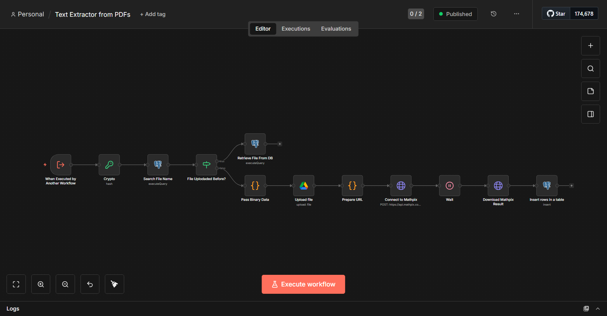
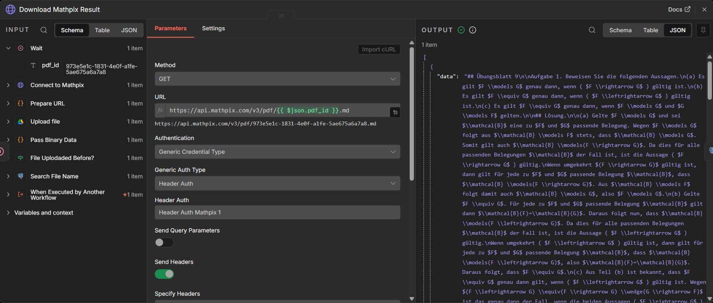

# PDF Text Extractor Workflow

An n8n sub-workflow that extracts the text of a PDF with the Mathpix API and caches the result in PostgreSQL, keyed by the file's SHA-256 hash, so the same file is never sent to Mathpix twice. It is called by [conversational-doc-agent](https://github.com/Javier-Briceno/conversational-doc-agent).



## How it works

The workflow is in `Text Extractor from PDFs.json`. Another workflow calls it with a PDF as binary data.

1. `Crypto` computes the SHA-256 hash of the file.
2. `Search File Name` looks the hash up in `pdf_extracted_text_cache`. If it is there, the stored text is returned.
3. Otherwise the PDF is uploaded to a Google Drive folder, a direct download link is built, and Mathpix is asked to convert that link to Markdown.
4. After a fixed wait, the Markdown is downloaded and stored in the cache table.



## Privacy

Mathpix fetches the PDF from a URL, so the Drive folder has to be shared with "anyone with the link". **Every PDF that passes through this workflow becomes readable by anyone who has its link.** Use it only for documents that may be public.

## Setup

1. Import `Text Extractor from PDFs.json` into n8n.
2. Create credentials: Header Auth for Mathpix (header `app_key`), Google Drive OAuth2, and PostgreSQL.
3. In the `Upload file` node, replace `YOUR_FOLDER_ID` with your own shared folder.
4. Create the cache table:

```sql
CREATE TABLE pdf_extracted_text_cache (
    id SERIAL PRIMARY KEY,
    google_drive_file_id VARCHAR(255) NOT NULL,
    file_name VARCHAR(500) NOT NULL,
    extracted_text TEXT NOT NULL,
    created_at TIMESTAMP DEFAULT CURRENT_TIMESTAMP,
    updated_at TIMESTAMP DEFAULT CURRENT_TIMESTAMP,
    file_hash VARCHAR(64),
    file_size VARCHAR(50),
    mime_type VARCHAR(100)
);

CREATE INDEX idx_file_hash ON pdf_extracted_text_cache(file_hash);
```

## Limits

- The workflow waits a fixed time before downloading the result. It does not check whether Mathpix has finished, so a long PDF can come back incomplete.
- There are no automated tests.
